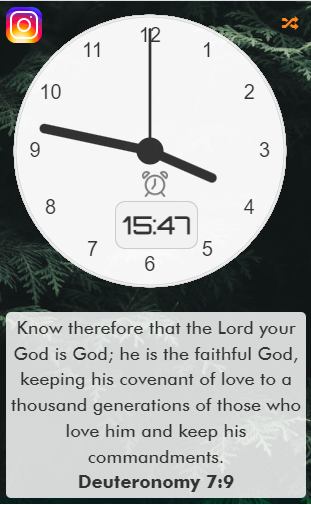

# Analog Clock Chrome Extension with Alarm and Daily Bible Verse

Welcome to the Analog Clock Chrome Extension with Alarm and Daily Bible Verse project! This extension brings an analog clock to your Chrome browser's new tab page, along with the convenience of setting alarms and receiving daily Bible verses. Here's a comprehensive guide to using and understanding this extension.


### Contents
1. [Installation](#installation)
1. [Features](#features)
1. [Usage](#usage)
1. [Customization](#customization)
1. [Credits](#credits)
1. [License](#license)
1. [Contact](#contact)


## Installation

To install and use the extension, follow these steps:

1. **Download the Extension Files:** Download or clone the extension files from the GitHub repository: [analog-clock-chrome-extension](https://github.com/FREDRICKKYEKI/analog-clock-chrome-extension).

    - For cloning...
         ```
         git clone https://github.com/FREDRICKKYEKI/analog-clock-chrome-extension.git
         ```

    - For downloading, click [here](https://github.com/FREDRICKKYEKI/analog-clock-in-js/archive/refs/heads/main.zip).
        - Download the link and unzip it using your preferred uncompressing software.
2. **Open Chrome Extensions:** Type `chrome://extensions/` into your Chrome browser's address bar and press Enter.

3. **Enable Developer Mode:** In the top right corner of the Extensions page, toggle on "Developer mode."

4. **Load the Extension:** Click the "Load unpacked" button and select the folder containing the extension files.

5. **New Tab Page:** Open a new tab in Chrome, and you'll see the Analog Clock extension in action!

6. **Finally, pin the extension to always be readily available when you need to use it**

## Features

1. **Analog Clock:** The extension displays a sleek analog clock with hour, minute, and second hands, providing you with the current time.

2. **Alarm Clock:** Easily set alarms for specific times:
   - Click the alarm icon
   - Select the alarm time
   - Click the "Set Alarm" button.
   - And voila! Alarm is set.
   - When the alarm time matches the current time, you will receive a chrome notification.

3. **Daily Bible Verse:** Start your day with a dose of inspiration:
   - Each day, a new Bible verse is fetched from the API and displayed beneath the clock.

## Usage

1. **Analog Clock:** Upon opening a new tab, the analog clock will be displayed, showing the current time.

2. **Alarm Clock:**
   - Click the "Set Alarm" button.
   - Use the arrow buttons to set the desired hour and minute.
   - Click "Save Alarm."
   - Enjoy the convenience of the alarm feature.

3. **Daily Bible Verse:** Let the wisdom of a new Bible verse brighten your day:
   - A fresh Bible verse will be fetched each day you open the extension.
 4. **Randomize background** Click the randomize icon to change the background into a random one that matches your preference.

## Customization

Tailor the extension to your preferences:

- **Styles:** Adjust the clock's appearance and layout by modifying the CSS in the extension's files.

- **Alarm Sound:** Replace the default alarm sound by substituting the `alarm.mp3` file with your chosen audio.

- **Bible Verse Source:** Modify the API endpoint in the JavaScript file (`script.js`) to change the source of the daily Bible verses.

## Credits

- Clock design inspiration is drawn from [w3schools](https://www.w3schools.com/about/) online CSS clock tutorials.
- The daily Bible verses are fetched from the [Ourmanna](https://ourmanna.readme.io/reference/getting-started-with-your-api) Bible API.

## License

This extension is released under the MIT License. Refer to the [`LICENSE`](./LICENSE) file for more details.

---

Enjoy your new Chrome extension! For queries or feedback, don't hesitate to reach out at fredrickisaac142@gmail.com . Happy browsing!
